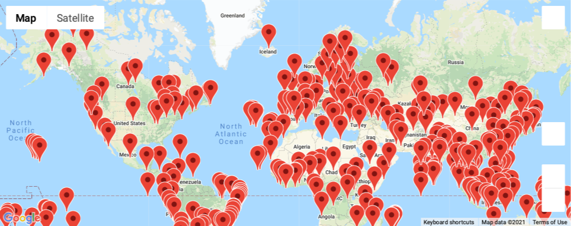
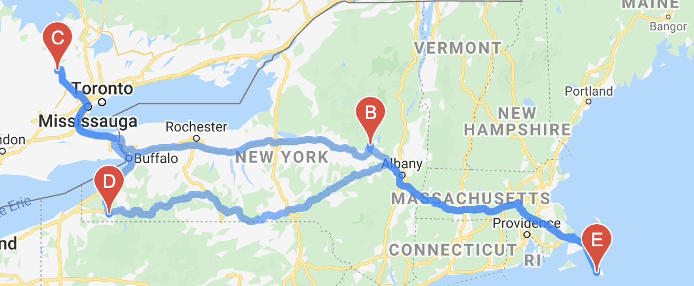
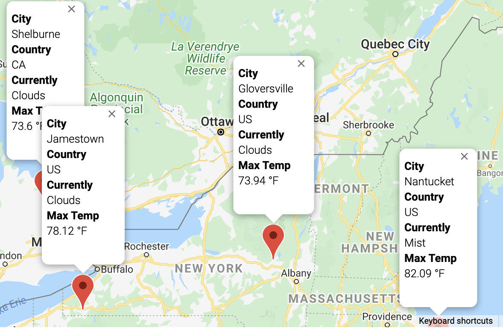

# World Weather Analysis

Developer: Stan Misina
Submission Date: Jul 18, 2021
Software Tools Used:
    Python 3.8 with libs: Pandas GMaps, NumPy, MatPlotLib, Requests, Random
API Keys used: Google, OpenWeather

## Objective

Create a travel itinerary between four points. These points are to be determined by first selecting 2000 random latitudes and longitudes, finding the city name of these points, then finding a hotel within 5000 meters of the Lat/Long pair. Lastly, using Google Maps Directions service, plot a tour between these points for travel, in this case, driving. In addition to the geographic information and lodging, provide current weather conditions and maximum temperature of the start/end and waypoints.

## Results

Objective met. The following maps demonstrate required development milestones:  

Global Plots of Randomized Points  
  

Calculated Travel Route  
  

Travel Route Markers
